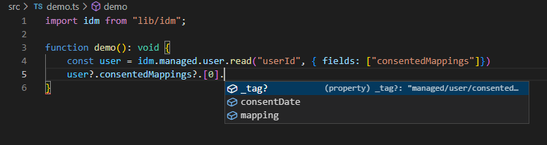
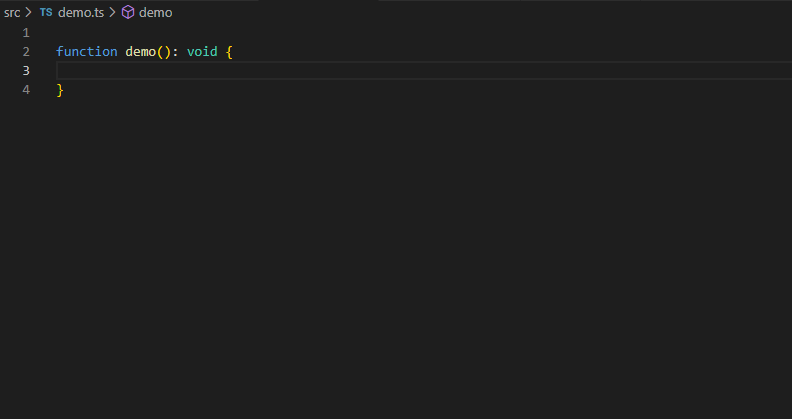
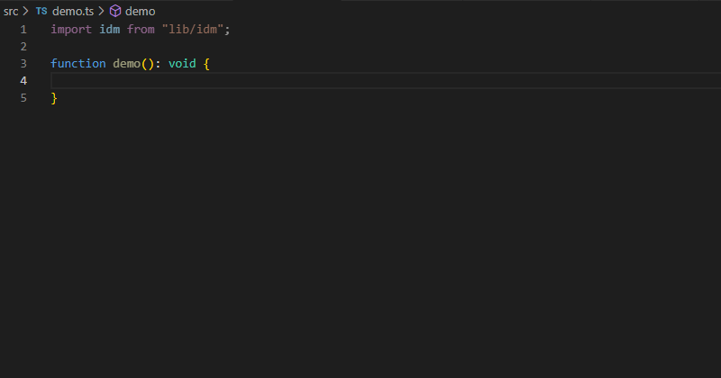
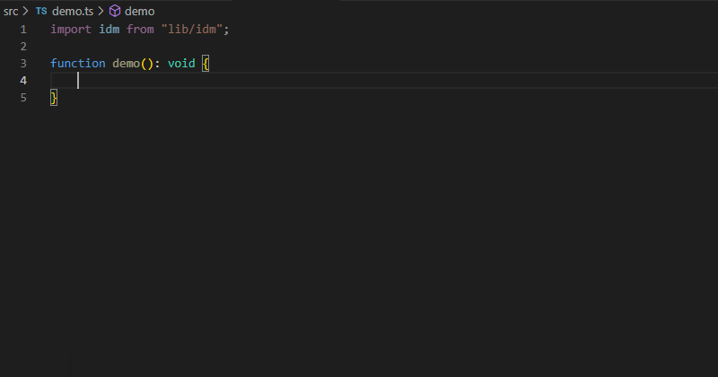

# ForgeRock IDM TypeScript Types <!-- omit in toc -->
[](https://www.npmjs.com/package/@agiledigital/idm-ts-types)
[](https://github.com/agiledigital/idm-ts-types/blob/master/LICENSE)
[](https://github.com/agiledigital/idm-ts-types/actions/workflows/release.yml)
[](https://github.com/plantain-00/type-coverage)
[](https://snyk.io/test/github/agiledigital/idm-ts-types?targetFile=package.json)
[](https://github.com/semantic-release/semantic-release)
[](http://commitizen.github.io/cz-cli/)

* TypeScript Support – Write your IDM JavaScript code in TypeScript which has modern language features while still being compatible with Rhino, the JavaScript engine that IDM uses.
* Type Safety – We've put together some TypeScript types that wrap the IDM API to ensure that all your calls to the API are type safe, plus you get the added benefit of getting type-ahead assistance from your IDE.
* Managed Object and Connector Type Generation – We've built a parser that can generate TypeScript types from your Managed Object and Connector types, this means that you can use your Managed Object or Connector types directly in TypeScript which enables IDE type-ahead assistance and type safety.

**Table of Contents**

- [Features](#features)
  - [TypeScript Type Code Generation](#typescript-type-code-generation)
    - [Supported Scenarios](#supported-scenarios)
    - [Complex Objects](#complex-objects)
    - [Relationships](#relationships)
      - [Handling Missing Relationship Types](#handling-missing-relationship-types)
      - [Relationship Limitations](#relationship-limitations)
  - [Type-safe Wrapper Functions](#type-safe-wrapper-functions)
  - [Query Filter DSL](#query-filter-dsl)
    - [Query Filter Functions](#query-filter-functions)
      - [Standard Built-in Equivalent Functions](#standard-built-in-equivalent-functions)
    - [Additional Query Helper Functions](#additional-query-helper-functions)
  - [Type-safe Patches](#type-safe-patches)
  - [Automatic type narrowing](#automatic-type-narrowing)
    - [Field Name Limitations](#field-name-limitations)
  - [ForgeRock API Documentation](#forgerock-api-documentation)
- [Getting Started](#getting-started)
- [Configuration](#configuration)
- [API Wrapper Documentation](#api-wrapper-documentation)
- [TypeScript Code Generation Documentation](#typescript-code-generation-documentation)
# Features

## TypeScript Type Code Generation

The foundational feature is the TypeScript type code generation, all the other features rely on the generated types to function correctly.

The [gen-idm-ts-types.js](bin/gen-idm-ts-types.js) script parses the Managed Object's (`managed.json`) and connector files (`provisioner.openicf-*.json`), and then generates the Typescript types.


A snippet of a simple `managed.json` file:
```json
{
    "$schema" : "http://forgerock.org/json-schema#",
    "type" : "object",
    "title" : "User",
    "icon" : "fa-user",
    "properties" : {
        "_id" : {
            "description" : "User ID",
            "type" : "string"
        },
        "userName" : {
            "title" : "Username",
            "description" : "Username",
            "type" : "string"
        },
        "password" : {
            "title" : "Password",
            "description" : "Password",
            "type" : "string"
        },
        "givenName" : {
            "title" : "First Name",
            "description" : "First Name",
            "type" : "string",
            "searchable" : true,
            "userEditable" : true,
            "usageDescription" : null,
            "isPersonal" : true
        }
    }
}
```

And a portion of the resulting Typescript type:

```typescript
export type ManagedUserDefaults = {
  _tag?: "managed/user";

  /**
   * User ID
   */
  _id?: string;

  /**
   * Username
   */
  userName: string;

  /**
   * Password
   */
  password?: string;

  /**
   * First Name
   */
  givenName: string;
}
```

### Supported Scenarios

Code generation supports the following scenarios:

| Scenario | Notes |
| -------- | ----- |
| Basic types | `string`, `number`/`integer`, `boolean`, `object`, `array` |
| [Complex Objects](#complex-objects) | Objects that have defined properties, are generated as separate sub-types, and have unlimited levels of nesting, more info [below](#complex-objects). |
| [Relationships](#relationships) | Fields that are [relationships](#relationships) simply use the target relationship as the type wrapped in a `ReferenceType`. It gracefully degrades when it can't find the target type to the `Record` type, this usually happens when referencing `internal` types which are not present in `managed.json`. |
| Nullable fields | Fields marked as _nullable_ in the schema have add `null` as a Typescript [union type](https://www.typescriptlang.org/docs/handbook/2/everyday-types.html#union-types), eg `string \| null`. |
| Return by default fields | A managed object type is composed of two separate objects, _default_ fields and _non-default_ fields. Unless overridden in the managed object schema, basic types are _return by default_, but relationships are not _return by default_. When using [Type-safe wrapper functions](#type-safe-wrapper-functions) if fields are not specified when reading an object, the type is narrowed to the _default_ fields only.
| Required fields | If the field is not marked as required then the typescript field name has a `?` appended, which makes it optional. |
| Title and Description fields | The description and title fields end up as comments on the generated fields | 


### Complex Objects

Complex Types are also supported, consented mappings is a good example.

```json
"consentedMappings" : {
    "title" : "Consented Mappings",
    "description" : "Consented Mappings",
    "type" : "array",
    "items" : {
        "type" : "array",
        "title" : "Consented Mappings Items",
        "items" : {
            "type" : "object",
            "title" : "Consented Mappings Item",
            "properties" : {
                "mapping" : {
                    "title" : "Mapping",
                    "description" : "Mapping",
                    "type" : "string",
                },
                "consentDate" : {
                    "title" : "Consent Date",
                    "description" : "Consent Date",
                    "type" : "string",
                }
            },
            "order" : [
                "mapping",
                "consentDate"
            ],
            "required" : [
                "mapping",
                "consentDate"
            ]
        }
    },
    "returnByDefault" : false,
    "isVirtual" : false
}
```

Which results in the following Typescript types:

```typescript
/**
 * user Managed Object Non Default fields
 *
 * These fields are only returned when explicitly mentioned or in the relationship case '*_ref' is used.
 */
export type ManagedUserNonDefaults = {
...
 /**
   * Consented Mappings
   */
  consentedMappings?: SubManagedUserConsentedMappings[];
...
}

/**
 * user Managed Object
 */
export type ManagedUser = ManagedUserDefaults & ManagedUserNonDefaults;

/**
 * user/consentedMappings Sub Type of {@link ManagedUser}
 */
export type SubManagedUserConsentedMappings = {
  // tslint:disable-next-line: no-duplicate-string
  _tag?: "managed/user/consentedMappings";

  /**
   * Mapping
   */
  mapping: string;

  /**
   * Consent Date
   */
  consentDate: string;
};
...

```

So when used in an example you can simply navigate into the object like this:



### Relationships

Fields that are [relationships](#relationships) simply use the target relationship as the type wrapped in a `ReferenceType`. It gracefully degrades to the `Record` type when it can't find the target type, this usually happens when referencing `internal` types which are not present in `managed.json`.

The code generation also understands relationships, and it uses the target relationship as the type wrapped in a generic `ReferenceType<T>`, for example `ReferenceType<ManagedUser>`. 

See the manager relationship which is a self-reference back to `managed/user`.

```json
"manager" : {
    "type" : "relationship",
    "reversePropertyName" : "reports",
    "description" : "Manager",
    "title" : "Manager",
    "resourceCollection" : [
        {
            "path" : "managed/user",
            "label" : "User",
            "query" : {
                "queryFilter" : "true",
                "fields" : [
                    "userName",
                    "givenName",
                    "sn"
                ]
            }
        }
    ],
    "userEditable" : false
},

```

Which ends up with generated code such as:

```typescript
export type ManagedUserNonDefaults = {
  /**
   * Manager
   */
  manager?: ReferenceType<ManagedUser>;
}
```

#### Handling Missing Relationship Types

Since IDM 7 the `authzRoles` relationship in _managed user_ only refers to `internal/role`, which is not defined in `managed.json`, so the code generation will not find it and will gracefully degrade to using either `Record<string, any>` or `Record<string, unknown>` depending on the [configuration](#configuration).

#### Relationship Limitations

Currently, user customisable relationship fields that are part of `_refProperties` do __not__ have their types automatically generated. For example `roles` has this `_refProperties`:

```json
"_refProperties" : {
    "description" : "Supports metadata within the relationship",
    "type" : "object",
    "title" : "Provisioning Roles Items _refProperties",
    "properties" : {
        "_id" : {
            "description" : "_refProperties object ID",
            "type" : "string"
        },
        "_grantType" : {
            "description" : "Grant Type",
            "type" : "string",
            "label" : "Grant Type"
        }
    }
}
```

Which defines `_grantType`, but the code generation won't create a type with `_grantType` in it. Perhaps in the future this scenario will be supported if there is interest.

Additionally, when using relationships and specifying which fields should be returned isn't supported when using [automatic type narrowing](#automatic-type-narrowing) as the type narrowing doesn't support forward slashes (eg `manager/givenName`), more information is at [field name limitations](#field-name-limitations).

## Type-safe Wrapper Functions

During code generation an addition object called `idm` is generated. The `idm` object is an extension of the built-in `openidm` object, but with wrappers added for all `managed` objects and connectors (`system`) objects.

These wrapper functions are where the power of the types really shines. As seen in the animation below, VS Code is able to auto-complete managed objects and connectors, as well as showing the fields available including any description/title. 



This is an example of a snippet from the bottom of the generated types where the wrapper functions are stored.

```typescript
export const idm = {
  ...openidm,
  managed: {
    assignment: idmObject<ManagedAssignment, ManagedAssignmentDefaults>("managed/assignment"),
    role: idmObject<ManagedRole, ManagedRoleDefaults>("managed/role"),
    user: idmObject<ManagedUser, ManagedUserDefaults>("managed/user")
  },
  system: {
    scimAccount: idmObject<SystemScimAccount, SystemScimAccount>("system/scim/account"),
    scimGroup: idmObject<SystemScimGroup, SystemScimGroup>("system/scim/group")
  }
};
```

When navigating through object type, eg `user`, `role`, etc. The same core functions (`create`/`update`/`patch`/`delete`/`query`) are available, with a few key differences:

1. The name of the type is not required, as this is defined as part of the function call context. For example, using `openidm` reading a managed user identifier of `abc123` looks like:
      ```typescript
      openidm.read("managed/user/abc123")
      ```
    Whereas with the wrapper it is instead:

      ```typescript
      idm.managed.user("abc123")
      ```
    In addition to general code completion assistance it also means if the managed user object is deleted or renamed then the code no longer compiles, giving your code extra integrity.

2. The return type of the function is the actual object type instead of a generic result type, or query response type. This also makes for robust code, as if a particular property doesn't exist then the code won't compile, for example, using the regular function typo's won't be detected:
      ```typescript
      const user = openidm.read("managed/user/abc123")
      // givenName spelt wrong, compiles fine, but breaks at runtime
      user.givonName
      ```
    Whereas with the wrapper it is instead:

      ```typescript
      const user = idm.managed.user("abc123")
      // Will fail to compile
      user.givonName
      ```
3. [Automatic type narrowing](#automatic-type-narrowing) is a really useful feature where you specify which fields you want back, and the resulting Typescript type knows that only those types are available. More details on this [below](#automatic-type-narrowing).
4. [Type safe query filter DSL](#query-filter-dsl) generates the `_queryFilter` in a type safe way, which prevents query syntax errors from being possible, as well as making it easier to build complex queries while still being readable. More on this [below](#query-filter-dsl).
5. The functions are overloaded with three variations which handle the fields in the returned object in different ways:
   1. A version that leverages the [type narrowing](#automatic-type-narrowing) and returns a narrowed type.
   2. A version that uses "unchecked fields" due to [type narrowing field name limitations](#field-name-limitations) which returns a type that has all possible fields.
   3. A version that where no fields are specified so only the "return by default" fields are available in the returned type.


There is one additional function that is not present in the `openidm` function called `relationship`. This is a convenience function that can build a relationship reference in a type safe manner.

For example instead of having to manually write:

```javascript
user.manager = {
  "_ref": "managed/user/babs"
}
```
   
You would instead write:

```typescript
user.manager = idm.managed.user.relationship("babs")
```

## Query Filter DSL

The query filter DSL is very powerful construct that allows building a query in a type safe manner. For example if field is deleted from your managed object and a query filter is referencing that field, normally you wouldn't notice it until run time. However, using the query filter DSL the query will no longer compile, saving you from bugs creeping into production unnoticed.

Other benefits are field name completion and value type checking when writing queries. For example if you have a field called `numLoginFailures` that is of type `number`, it will ensure that when using the field in the query is a `number` and won't let you use a `string` by mistake.

The following animation shows how to write a query using code completion as well as showcasing the `oneOf` function which is a shortcut way to field is one of multiple different values (like the SQL IN operator):



### Query Filter Functions

#### Standard Built-in Equivalent Functions

| Operator Name | Function Name | Example | Query Filter Equivalent |
| --- | --- | --- | --- |
| Equals | `equals` | `equals("accountStatus", "active")` | `/accountStatus eq "active"` |
| Greater | `greater` | `greater("loginFailures", 5)` | `/loginFailures gt 5` |
| Greater or Equal | `greaterOrEqual` | `greaterOrEqual("loginFailures", 6)` | `/loginFailures ge 6` |
| Less | `less` | `less("loginFailures", 1)` | `/loginFailures lt 1` |
| Less or Equal | `lessOrEqual` | `lessOrEqual("loginFailures", 0)` | `/loginFailures le 0` |
| Contains | `contains` | `contains("mail", "gmail")` | `/mail co "gmail"` |
| Starts With | `startsWith` | `startsWith("mail", "john@")` | `/mail sw "john@"` |
| And | `and` | `and(equals("givenName", "John"), equals("sn", "Citizen"))` | `(/givenName eq "John" and /sn eq "Citizen")` |
| Or | `or` | `or(equals("givenName", "John"), equals("givenName", "Mary"))` | `(/givenName eq "John" or /givenName eq "Mary")` |
| Not | `not` | `not(presence("mail"))` | `!(/mail pr)` |
| Presence | `presence` | `presence("mail")` | `/mail pr` |
| True | `true` | `trueVal` | `trueVal()` |
| False | `false` | `falseVal` | `falseVal()` |

### Additional Query Helper Functions

**`allOf`**

The `allOf` function combines multiple filters returning true if all are true, i.e. it `and`'s all the filters together.

For example, you can write:

```typescript
allOf(
    equals("accountStatus", "active"),
    equals("givenName", "John"),
    equals("sn", "Citizen")
)
```

Which is equivalent to:

```
((/accountStatus eq "active" and /givenName eq "John") and /sn eq "Citizen")
```

**`andOf`**

The `andOf` function combines multiple filters returning true if any are true, i.e. it `or`'s all the filters together.

```typescript
anyOf(
    equals("givenName", "John"),
    equals("sn", "John"),
    contains("mail", "john")
)
```

Which is equivalent to:

```
((/givenName eq "John or /sn eq "John") or /mail co "john")

```

**`oneOf`**

The `oneOf` function is essentially SQL's `IN` operator. Given a field and a collection of values this returns `true` if any are `true`.

```typescript
oneOf("givenName", "John", "Mary", "Jane")
```

Which is equivalent to:

```
((/givenName eq "John" or /givenName eq "Mary") or /givenName eq "Jane")
```


## Type-safe Patches

Show how patches are also type safe


## Automatic type narrowing

Show how selecting fields can narrow the type



### Field Name Limitations

## ForgeRock API Documentation

The [Type-safe Wrapper functions](#type-safe-wrapper-functions) and built-in variables like `openidm` and `identityServer` have official documentation added to the TypeScript types, so that you can easily find how to use the function without needing to browse the ForgeRock documentation.

The reference for the documentation has used the following URLs:

* https://backstage.forgerock.com/docs/idm/7.2/scripting-guide/scripting-func-ref.html
* https://backstage.forgerock.com/docs/idm/7.2/crest/crest-query.html
* And others...


# Getting Started

Need to describe how to use the various parts of `idm-ts-types` and how to configure it. Then point to `idm-seed` as a working example.

# Configuration

`config/default.json`
```json
{
    "idmTsCodeGen": {
        "idmTsTypesOutputFile": "./lib/idm.ts",
        "idmProjectConfigDir": "./project/conf",
        "useUnknownInsteadOfAny": false,
        "useUnknownInsteadOfAnyForManagedObj": null,
        "useUnknownInsteadOfAnyForConnectorObj": null
    }
}
```

`config/custom-environment-variables.json`
```json
{
    "idmTsCodeGen": {
        "idmTsTypesOutputFile": "IDM_TS_TYPES",
        "idmProjectConfigDir": "IDM_CONFIG_DIR",
        "useUnknownInsteadOfAny": "IDM_TS_TYPES_USE_UNKNOWN",
        "useUnknownInsteadOfAnyForManagedObj": "IDM_TS_TYPES_USE_UNKNOWN_MANAGED",
        "useUnknownInsteadOfAnyForConnectorObj": "IDM_TS_TYPES_USE_UNKNOWN_CONNECTOR"
    }
}
```

# API Wrapper Documentation
TODO

# TypeScript Code Generation Documentation
TODO