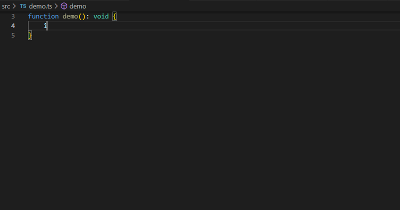

# ForgeRock IDM TypeScript Types <!-- omit in toc -->
[](https://www.npmjs.com/package/@agiledigital/idm-ts-types)
[](https://github.com/agiledigital/idm-ts-types/blob/master/LICENSE)
[](https://github.com/agiledigital/idm-ts-types/actions/workflows/release.yml)
[](https://github.com/plantain-00/type-coverage)
[](https://snyk.io/test/github/agiledigital/idm-ts-types?targetFile=package.json)
[](https://github.com/semantic-release/semantic-release)
[](http://commitizen.github.io/cz-cli/)

* TypeScript Support – Write your IDM JavaScript code in TypeScript which has modern language features while still being compatible with Rhino, the JavaScript engine that IDM uses.
* Type Safety – We've put together some TypeScript types that wrap the IDM API to ensure that all your calls to the API are type safe, plus you get the added benefit of getting type-ahead assistance from your IDE.
* Managed Object and Connector Type Generation – We've built a parser that can generate TypeScript types from your Managed Object and Connector types, this means that you can use your Managed Object or Connector types directly in TypeScript which enables IDE type-ahead assistance and type safety.

**Table of Contents**

- [Features](#features)
  - [TypeScript Type Code Generation](#typescript-type-code-generation)
    - [Supported Scenarios](#supported-scenarios)
    - [Complex Objects](#complex-objects)
    - [Relationships](#relationships)
      - [Handling Missing Relationship Types](#handling-missing-relationship-types)
      - [Relationship Limitations](#relationship-limitations)
  - [Type-safe Wrapper Functions](#type-safe-wrapper-functions)
  - [Query Filter DSL](#query-filter-dsl)
  - [Type-safe Patches](#type-safe-patches)
  - [Automatic type narrowing](#automatic-type-narrowing)
    - [Field Name Limitations](#field-name-limitations)
  - [ForgeRock API Documentation](#forgerock-api-documentation)
- [Getting Started](#getting-started)
- [Configuration](#configuration)
- [API Wrapper Documentation](#api-wrapper-documentation)
- [TypeScript Code Generation Documentation](#typescript-code-generation-documentation)
# Features

## TypeScript Type Code Generation

The foundational feature is the TypeScript type code generation, all the other features rely on the generated types to function correctly.

The [gen-idm-ts-types.js](bin/gen-idm-ts-types.js) script parses the Managed Object's (`managed.json`) and connector files (`provisioner.openicf-*.json`), and then generates the Typescript types.


A snippet of a simple `managed.json` file:
```json
{
    "$schema" : "http://forgerock.org/json-schema#",
    "type" : "object",
    "title" : "User",
    "icon" : "fa-user",
    "properties" : {
        "_id" : {
            "description" : "User ID",
            "type" : "string"
        },
        "userName" : {
            "title" : "Username",
            "description" : "Username",
            "type" : "string"
        },
        "password" : {
            "title" : "Password",
            "description" : "Password",
            "type" : "string"
        },
        "givenName" : {
            "title" : "First Name",
            "description" : "First Name",
            "type" : "string",
            "searchable" : true,
            "userEditable" : true,
            "usageDescription" : null,
            "isPersonal" : true
        }
    }
}
```

And a portion of the resulting Typescript type:

```typescript
export type ManagedUserDefaults = {
  _tag?: "managed/user";

  /**
   * User ID
   */
  _id?: string;

  /**
   * Username
   */
  userName: string;

  /**
   * Password
   */
  password?: string;

  /**
   * First Name
   */
  givenName: string;
}
```

### Supported Scenarios

Code generation supports the following scenarios:

| Scenario | Notes |
| -------- | ----- |
| Basic types | `string`, `number`/`integer`, `boolean`, `object`, `array` |
| [Complex Objects](#complex-objects) | Objects that have defined properties, are generated as separate sub-types, and have unlimited levels of nesting, more info [below](#complex-objects). |
| [Relationships](#relationships) | Fields that are [relationships](#relationships) simply use the target relationship as the type wrapped in a `ReferenceType`. It gracefully degrades when it can't find the target type to the `Record` type, this usually happens when referencing `internal` types which are not present in `managed.json`. |
| Nullable fields | Fields marked as _nullable_ in the schema have add `null` as a Typescript [union type](https://www.typescriptlang.org/docs/handbook/2/everyday-types.html#union-types), eg `string \| null`. |
| Return by default fields | A managed object type is composed of two separate objects, _default_ fields and _non-default_ fields. Unless overridden in the managed object schema, basic types are _return by default_, but relationships are not _return by default_. When using [Type-safe wrapper functions](#type-safe-wrapper-functions) if fields are not specified when reading an object, the type is narrowed to the _default_ fields only.
| Required fields | If the field is not marked as required then the typescript field name has a `?` appended, which makes it optional. |
| Title and Description fields | The description and title fields end up as comments on the generated fields | 


### Complex Objects

Complex Types are also supported, consented mappings is a good example.

```json
"consentedMappings" : {
    "title" : "Consented Mappings",
    "description" : "Consented Mappings",
    "type" : "array",
    "items" : {
        "type" : "array",
        "title" : "Consented Mappings Items",
        "items" : {
            "type" : "object",
            "title" : "Consented Mappings Item",
            "properties" : {
                "mapping" : {
                    "title" : "Mapping",
                    "description" : "Mapping",
                    "type" : "string",
                },
                "consentDate" : {
                    "title" : "Consent Date",
                    "description" : "Consent Date",
                    "type" : "string",
                }
            },
            "order" : [
                "mapping",
                "consentDate"
            ],
            "required" : [
                "mapping",
                "consentDate"
            ]
        }
    },
    "returnByDefault" : false,
    "isVirtual" : false
}
```

Which results in the following Typescript types:

```typescript
/**
 * user Managed Object Non Default fields
 *
 * These fields are only returned when explicitly mentioned or in the relationship case '*_ref' is used.
 */
export type ManagedUserNonDefaults = {
...
 /**
   * Consented Mappings
   */
  consentedMappings?: SubManagedUserConsentedMappings[];
...
}

/**
 * user Managed Object
 */
export type ManagedUser = ManagedUserDefaults & ManagedUserNonDefaults;

/**
 * user/consentedMappings Sub Type of {@link ManagedUser}
 */
export type SubManagedUserConsentedMappings = {
  // tslint:disable-next-line: no-duplicate-string
  _tag?: "managed/user/consentedMappings";

  /**
   * Mapping
   */
  mapping: string;

  /**
   * Consent Date
   */
  consentDate: string;
};
...

```

So when used in an example you can simply navigate into the object like this:


### Relationships

Fields that are [relationships](#relationships) simply use the target relationship as the type wrapped in a `ReferenceType`. It gracefully degrades when it can't find the target type to the `Record` type, this usually happens when referencing `internal` types which are not present in `managed.json`.

The code generation also understands relationships, and it uses the target relationship as the type wrapped in a generic `ReferenceType<T>`, for example `ReferenceType<ManagedUser>`. 

See the manager relationship which is a self-reference.

```json
"manager" : {
    "type" : "relationship",
    "reversePropertyName" : "reports",
    "description" : "Manager",
    "title" : "Manager",
    "resourceCollection" : [
        {
            "path" : "managed/user",
            "label" : "User",
            "query" : {
                "queryFilter" : "true",
                "fields" : [
                    "userName",
                    "givenName",
                    "sn"
                ]
            }
        }
    ],
    "userEditable" : false
},

```


```typescript
export type ManagedUserNonDefaults = {
  /**
   * Manager
   */
  manager?: ReferenceType<ManagedUser>;
}
```

#### Handling Missing Relationship Types

Since IDM 7 the `authzRoles` relationship in _managed user_ only refers to `internal/role`, which is not defined in `managed.json`, so the code generation will not find it and will gracefully degrade to using either `Record<string, any>` or `Record<string, unknown>` depending on the [configuration](#configuration).

#### Relationship Limitations

Currently, user customisable relationship fields that are part of `_refProperties` do __not__ have their types automatically generated. For example `roles` has this `_refProperties`:

```json
"_refProperties" : {
    "description" : "Supports metadata within the relationship",
    "type" : "object",
    "title" : "Provisioning Roles Items _refProperties",
    "properties" : {
        "_id" : {
            "description" : "_refProperties object ID",
            "type" : "string"
        },
        "_grantType" : {
            "description" : "Grant Type",
            "type" : "string",
            "label" : "Grant Type"
        }
    }
}
```

Which defines `_grantType`, but the code generation won't create a type with `_grantType` in it. Perhaps in the future this scenario will be supported if there is interest.

## Type-safe Wrapper Functions

Compare `openidm` functions vs wrapper functions.

The code generation also generates wrapper functions for all the managed objects and connectors. This is where the power of the types really shines.


```typescript
export const idm = {
  ...openidm,
  managed: {
    SubTypeTest: idmObject<ManagedSubTypeTest, ManagedSubTypeTestDefaults>("managed/SubTypeTest"),
    assignment: idmObject<ManagedAssignment, ManagedAssignmentDefaults>("managed/assignment"),
    pendingRelationships: idmObject<ManagedPendingRelationships, ManagedPendingRelationshipsDefaults>("managed/pendingRelationships"),
    role: idmObject<ManagedRole, ManagedRoleDefaults>("managed/role"),
    user: idmObject<ManagedUser, ManagedUserDefaults>("managed/user")
  },
  system: {
    scimAccount: idmObject<SystemScimAccount, SystemScimAccount>("system/scim/account"),
    scimGroup: idmObject<SystemScimGroup, SystemScimGroup>("system/scim/group"),
    usersWithManagersAccount: idmObject<SystemUsersWithManagersAccount, SystemUsersWithManagersAccount>("system/UsersWithManagers/__ACCOUNT__")
  }
};
```

Show examples of all the main functions:

* create
* update
* patch
* delete
* relationship
* query

## Query Filter DSL

Showcase the Query Filter DSL


## Type-safe Patches

Show how patches are also type safe



## Automatic type narrowing

Show how selecting fields can narrow the type


### Field Name Limitations

## ForgeRock API Documentation

The [Type-safe Wrapper functions](#type-safe-wrapper-functions) and built-in variables like `openidm` and `identityServer` have official documentation added to the TypeScript types, so that you can easily find how to use the function without needing to browse the ForgeRock documentation.

The reference for the documentation has used the following URLs:

* https://backstage.forgerock.com/docs/idm/7.2/scripting-guide/scripting-func-ref.html
* https://backstage.forgerock.com/docs/idm/7.2/crest/crest-query.html
* And others...


# Getting Started

Need to describe how to use the various parts of `idm-ts-types` and how to configure it. Then point to `idm-seed` as a working example.

# Configuration

`config/default.json`
```json
{
    "idmTsCodeGen": {
        "idmTsTypesOutputFile": "./lib/idm.ts",
        "idmProjectConfigDir": "./project/conf",
        "useUnknownInsteadOfAny": false,
        "useUnknownInsteadOfAnyForManagedObj": null,
        "useUnknownInsteadOfAnyForConnectorObj": null
    }
}
```

`config/custom-environment-variables.json`
```json
{
    "idmTsCodeGen": {
        "idmTsTypesOutputFile": "IDM_TS_TYPES",
        "idmProjectConfigDir": "IDM_CONFIG_DIR",
        "useUnknownInsteadOfAny": "IDM_TS_TYPES_USE_UNKNOWN",
        "useUnknownInsteadOfAnyForManagedObj": "IDM_TS_TYPES_USE_UNKNOWN_MANAGED",
        "useUnknownInsteadOfAnyForConnectorObj": "IDM_TS_TYPES_USE_UNKNOWN_CONNECTOR"
    }
}
```

# API Wrapper Documentation
TODO

# TypeScript Code Generation Documentation
TODO